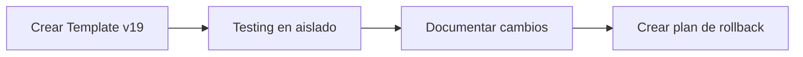

# Guía de Migración: Odoo v17 → v19
## ERP_Core SaaS Multi-Tenant

**Fecha**: Febrero 2026
**Estado**: Plan de Migración Inicial
**Versión del Documento**: 1.0

---

## 📋 Tabla de Contenidos

1. [Resumen Ejecutivo](#resumen-ejecutivo)
2. [Análisis de Impacto](#análisis-de-impacto)
3. [Cambios Críticos v17→v19](#cambios-críticos-v17v19)
4. [Estrategia de Migración](#estrategia-de-migración)
5. [Componentes Afectados](#componentes-afectados)
6. [Plan de Ejecución](#plan-de-ejecución)
7. [Validación y Testing](#validación-y-testing)
8. [Rollback y Contingencia](#rollback-y-contingencia)

---

## 📊 Resumen Ejecutivo

### Situación Actual
- **Base**: Copia de Odoo v17
- **Destino**: Odoo v19
- **Arquitectura**: Multi-tenant SaaS en LXC containers (Proxmox)
- **Integración**: FastAPI + Svelte + PostgreSQL

### Saltos de Versión
```
Odoo 17 → Odoo 18 → Odoo 19
(2 releases)
```

### Estimación de Esfuerzo
| Componente | Esfuerzo | Riesgo | Criticidad |
|-----------|----------|--------|------------|
| Database migration | 40h | ALTO | CRÍTICA |
| Module code update | 60h | ALTO | ALTA |
| API compatibility | 30h | MEDIO | ALTA |
| Testing & validation | 50h | MEDIO | CRÍTICA |
| Deployment & rollback | 20h | BAJO | MEDIA |
| **TOTAL** | **200h** | - | - |

---

## 🔍 Análisis de Impacto

### 1. Base de Datos (CRÍTICO)
**Cambios principales v17→v19:**
- Estructura de módulos y datos del sistema
- Cambios en `ir.model`, `ir.model.fields`, `ir.model.fields.selection`
- Cambios en tablas de autenticación y sesiones
- Nueva estructura de configuración (`ir_config_parameter`)
- Cambios en `res.users`, `res.partner`, `res.company`

**Impacto en ERP_Core:**
```python
# Afectado en: odoo_database_manager.py
- Template database (template_tenant)
- All tenant databases created from v17 template
- SQL queries en _configure_new_database()
- _reset_database_after_duplicate()
```

### 2. Provisioning System (ALTA)

**Código actual en `odoo_provisioner.py`:**
```python
async def provision_tenant(subdomain, admin_email, company_name, ...):
    # Llama a script de bash que ejecuta comandos Odoo v17
    # Usa CREATE_TENANT_SCRIPT con flags específicos de v17
```

**Cambios necesarios:**
- Scripts de provisioning deben ser v19-compatible
- Validaciones de campos pueden cambiar
- Configuración post-provisioning diferente

### 3. OdooDatabaseManager (ALTA)

**Endpoints HTTP afectados:**
```
POST /web/database/list      → Compatible (probablemente)
POST /web/database/create    → Cambios en payloads
POST /web/database/duplicate → Cambios en payloads
POST /web/database/drop      → Compatible (probablemente)
```

**Cambios en payloads v17→v19:**
```python
# v17
{
    "master_pwd": "...",
    "name": "db_name",
    "login": "admin@example.com",
    "password": "...",
    "lang": "es_DO",
    "country_code": "DO",
    "phone": ""
}

# v19 - Pueden haber nuevos campos requeridos
# - Ejemplo: timezone, company_type, etc.
```

### 4. Modelos de Datos (ALTA)

**Campos críticos afectados:**
```python
# En models/database.py:

TenantDeployment:
    - odoo_port (probablemente sin cambios)
    - database_name (sin cambios)

CustomDomain:
    - target_node_ip (probablemente sin cambios)
    - target_port (probablemente sin cambios)

SystemConfig:
    - Algunos keys pueden ser inválidos en v19
    - Ej: ODOO_DEFAULT_LANG, ODOO_DEFAULT_COUNTRY
```

### 5. Rutas de API (MEDIA)

**Archivos en `app/routes/`:**
```
- onboarding.py: Llama a provision_tenant()
- settings.py: Usa get_odoo_config()
- provisioning.py: Gestiona provisioning
```

**Cambios necesarios:**
- Validaciones de parámetros
- Manejo de errores (los códigos de error pueden cambiar)
- Respuestas API pueden cambiar estructura

---

## 🔄 Cambios Críticos v17→v19

### 1. Framework ORM
| Aspecto | v17 | v19 | Impacto |
|--------|-----|-----|---------|
| `_inherit` | Soportado | Soportado | ✅ Ninguno |
| `api.model` | Deprecado | Removido | ⚠️ Refactor |
| `api.multi` | Deprecado | Removido | ⚠️ Refactor |
| `api.one` | Removido | N/A | 🔴 Crítico |
| Field types | Varios | Varios | ⚠️ Revisar |

### 2. Cambios en Modelos Base

#### `ir.config_parameter`
```python
# v17
ir_config_parameter {
    'web.base.url': 'https://tenant.sajet.us',
    'mail.catchall.domain': 'tenant.sajet.us',
    'database.uuid': 'uuid...'
}

# v19 - Estructura igual, pero nuevos keys esperados
ir_config_parameter {
    'web.base.url': 'https://tenant.sajet.us',
    'mail.catchall.domain': 'tenant.sajet.us',
    'database.uuid': 'uuid...',
    'web.base.url.freeze': 'True'  # Nuevo en v18+
    # Posiblemente más keys nuevos
}
```

#### `res.users` y `res.partner`
```python
# Cambios en campos y validaciones
# Posibles nuevos campos requeridos en v19
```

#### Sesiones (`ir.session`)
```python
# Estructura de sesiones puede cambiar
# Afecta a auth en provisioning
```

### 3. Cambios en `/web/database/*` API
```
v17: Endpoints base funcionales
v18: Pequeños cambios en params
v19: Posibles cambios en validación de master password
      Posibles nuevos campos requeridos en creación
```

### 4. Cambios en Scripting
```bash
# v17 shell commands
odoo-bin -d dbname --init=base

# v19 - Posibles cambios en flags
odoo-bin -d dbname --init=base --without-demo
```

### 5. Seguridad
```python
# v17: Password hashing con werkzeug
# v19: Posiblemente cambios en algoritmo de hash

# Afecta a: _reset_database_after_duplicate()
UPDATE res_users SET password = '{admin_password}' WHERE id = 2;
```

---

## 📈 Estrategia de Migración

### Opción 1: **Migración In-Place** (Recomendada - Riesgosa)
```
Template v17 → Upgrade → Template v19
    ↓
Todos los tenants se actualizan juntos
```
**Ventajas**: Rápido, simples operaciones
**Desventajas**: Sin rollback, todos afectados simultáneamente
**Riesgo**: 🔴 ALTO

### Opción 2: **Migración Gradual** (Recomendada - Más segura)
```
Template v17 (mantener)
    ↓
Crear Template v19 nuevo
    ↓
Nuevos tenants en v19
    ↓
Migrar tenants existentes gradualmente
```
**Ventajas**: Bajo riesgo, rollback fácil, testing incremental
**Desventajas**: Más tiempo, hay dos versiones temporalmente
**Riesgo**: 🟢 BAJO

### Opción 3: **Migración Canary** (Más segura)
```
1. Migrar 1-2 tenants de prueba a v19
2. Validar completamente
3. Si OK → Migrar resto en lotes
```
**Ventajas**: Máxima seguridad, detecta problemas temprano
**Desventajas**: Más lento, más manual
**Riesgo**: 🟢 BAJO

### 🎯 **Recomendación: Opción 2 + Testing**

---

## 🔧 Componentes Afectados

### A. `app/services/odoo_database_manager.py` (ALTA PRIORIDAD)

#### Cambios requeridos:

1. **Lista de payloads HTTP**
```python
# Revisar y actualizar create_database() payload
# Verificar que todos los campos son válidos en v19
# Posibles nuevos campos requeridos
```

2. **SQL queries**
```python
# _configure_new_database() - Revisar queries
# _reset_database_after_duplicate() - Revisar queries
# get_database_info() - Revisar queries
```

3. **Validaciones**
```python
# Revisar que master_password sigue siendo válido
# Revisar lang y country_code aceptados en v19
```

#### Líneas críticas:
- L215-223: Payload de creación
- L291-295: SQL config post-creación
- L336-343: Payload de duplicación
- L392-400: SQL reset post-duplicación
- L451-456: SQL info query

### B. `app/services/odoo_provisioner.py` (ALTA PRIORIDAD)

#### Cambios requeridos:

1. **Script de provisioning**
```bash
# CREATE_TENANT_SCRIPT debe ser v19-compatible
# Revisar path: scripts/pct_push_160.sh
# Revisar flags de create_tenant_script
```

2. **Validaciones de parámetros**
```python
# L34: _validate_subdomain() - Probablemente OK
# L49-50: _validate_email() - Probablemente OK
# L181-186: Validaciones generales - Revisar
```

3. **Configuración post-provisioning**
```python
# L224-228: create_cloudflare_tunnel() - Probablemente OK
# Revisar que los parámetros siguen siendo válidos
```

#### Líneas críticas:
- L202: Script execution command
- L331-334: Template download/creation

### C. `app/models/database.py` (MEDIA PRIORIDAD)

#### Cambios requeridos:

1. **TenantDeployment model**
```python
# L191-221: Revisar que campos siguen siendo relevantes
# Posibles nuevos campos para v19
```

2. **CustomDomain model**
```python
# L224-285: Probablemente sin cambios
# Revisar que campos son still compatible
```

3. **SystemConfig keys**
```python
# Revisar ODOO_DEFAULT_LANG
# Revisar ODOO_DEFAULT_COUNTRY
# Verificar que keys son válidas en v19
```

#### Líneas críticas:
- L38-52: Default config values
- L104-126: ODOO_SERVERS config
- L179: template_used field
- L202: odoo_port

### D. `app/routes/onboarding.py` (MEDIA PRIORIDAD)

#### Cambios requeridos:

1. **Llamadas a provision_tenant()**
```python
# Revisar parámetros pasados
# Verificar que siguen siendo válidos en v19
```

2. **Manejo de respuestas**
```python
# Revisar códigos de error esperados
# Posibles nuevos errores en v19
```

### E. `app/routes/settings.py` (MEDIA PRIORIDAD)

#### Cambios requeridos:

1. **OdooConfigUpdateRequest**
```python
# Revisar qué campos se pueden actualizar
# Posibles nuevos campos en v19
```

2. **get_odoo_config()**
```python
# Revisar que retorna información válida
```

### F. Scripts de infraestructura (MEDIA PRIORIDAD)

**Archivos afectados:**
```
scripts/odoo_db_watcher.py       - Revisar queries SQL
scripts/odoo_local_api.py        - Revisar endpoints
nodo/scripts/odoo_db_watcher.py - Revisar queries SQL
nodo/scripts/odoo_local_api.py  - Revisar endpoints
```

---

## 📋 Plan de Ejecución

### Fase 0: Preparación (1 semana)



**Tareas:**

1. **Obtener Odoo v19**
```bash
# En container separado
pct create 107 --hostname odoo-v19-temp \
    --storage local --size 50 --cores 4 --memory 8192
cd /root && git clone https://github.com/odoo/odoo.git \
    --branch 19.0 --single-branch
# O descargar desde odoo.com
```

2. **Crear template database v19**
```bash
# Crear BD vacía v19 con datos base
odoo-bin -d template_tenant_v19 --init=base --without-demo
```

3. **Documentar diferencias**
```bash
# Comparar schemas
pg_dump --schema-only template_tenant > v17_schema.sql
pg_dump --schema-only template_tenant_v19 > v19_schema.sql
diff v17_schema.sql v19_schema.sql > schema_diff.txt
```

4. **Actualizar código ERP_Core**
```bash
# Branch para v19
git checkout -b feature/odoo-v19-migration
```

### Fase 1: Actualización de Database Manager (1 semana)

**1.1. Revisar payloads HTTP**
```python
# odoo_database_manager.py L215-223
# Crear tabla de compatibilidad:
```

| Campo | v17 | v19 | Acción |
|-------|-----|-----|--------|
| master_pwd | ✅ | ✅ | Mantener |
| name | ✅ | ✅ | Mantener |
| login | ✅ | ✅ | Mantener |
| password | ✅ | ✅ | Mantener |
| lang | ✅ | ✅ | Mantener |
| country_code | ✅ | ✅ | Mantener |
| phone | ✅ | ✅ | Mantener |
| ? | ? | ✅ | Agregar |

**1.2. Revisar SQL queries**
```python
# L291-295: _configure_new_database()
# Verificar que ir_config_parameter keys existen

# L392-400: _reset_database_after_duplicate()
# Verificar que res_users, res_company, ir_config_parameter existen
```

**1.3. Testing**
```python
# crear tests/test_v19_compatibility.py
def test_create_database_v19():
    # Test contra v19 test server
    pass

def test_duplicate_database_v19():
    pass
```

### Fase 2: Actualización de Provisioner (1 semana)

**2.1. Validar scripts de shell**
```bash
# Revisar: scripts/pct_push_160.sh
# Revisar: Cloudflare/create_tenant.sh (si existe)
# Actualizar a v19 syntax
```

**2.2. Actualizar calls**
```python
# odoo_provisioner.py L202
# Asegurar que comando sigue siendo válido

# Crear variantes:
cmd_v17 = f"pct exec {lxc_id} -- .../create_tenant_v17.sh"
cmd_v19 = f"pct exec {lxc_id} -- .../create_tenant_v19.sh"
```

**2.3. Testing**
```python
def test_provision_tenant_v19():
    # Test provisioning en v19
    pass
```

### Fase 3: Migración de Template Database (2 semanas)

**3.1. Backup completo**
```bash
# Backup de todo
pg_dump template_tenant -Fc > /backups/template_tenant_v17_$(date +%s).dump
pct snapshot 105 --snapname before_v19_migration
```

**3.2. Crear BD vacía en v19**
```bash
# Opción A: desde v19 limpio (recomendado)
createdb -T template0 template_tenant_v19_temp
odoo-bin -d template_tenant_v19_temp --init=base --without-demo

# Opción B: upgrade in-place (riesgoso)
# ... (scripts de upgrade de Odoo)
```

**3.3. Validar template**
```bash
# Verificar:
# - que los módulos básicos están instalados
# - que la estructura es igual a v17
# - que se puede duplicar correctamente
```

### Fase 4: Migración de Tenants (3-4 semanas)

#### Estrategia Gradual:

**Semana 1: Tenants de prueba (canary)**
```
cliente_test_1 → v19
cliente_test_2 → v19
(monitorear 1 semana)
```

**Semana 2-3: Migrar lotes**
```
Lote A (10 tenants) → v19
Esperar 3 días
Lote B (10 tenants) → v19
...
```

**Semana 4: Último lote + verificación**

#### Por tenant:
```bash
# Backup pre-migración
pg_dump tenant_name -Fc > backups/tenant_name_v17_$(date +%s).dump

# Opción 1: Duplicar desde v19 template (más seguro)
# 1. Crear BD vacía desde v19 template
# 2. Exportar datos de v17
# 3. Importar datos en v19

# Opción 2: Upgrade in-place (rápido pero riesgoso)
# 1. Ejecutar upgrade script de Odoo
```

**Migración Opción 1 (Recomendada - Duplicación):**

```bash
#!/bin/bash
TENANT="acme"
CONTAINER_IP="10.10.10.100"
CONTAINER_ID=105

# 1. Backup
pg_dump $TENANT -Fc > /backups/${TENANT}_v17.dump

# 2. Crear desde template v19
psql -U Jeturing -h $CONTAINER_IP -d postgres -c \
  "CREATE DATABASE \"${TENANT}_v19_temp\" WITH TEMPLATE \"template_tenant_v19\""

# 3. Exportar config de v17
pg_dump $TENANT --table="ir_config_parameter" \
    --table="res_company" \
    --table="res_partner" \
    > /tmp/${TENANT}_config.sql

# 4. Importar en v19 (excepto tablas que duplicamos)
psql -U Jeturing -h $CONTAINER_IP -d ${TENANT}_v19_temp < /tmp/${TENANT}_config.sql

# 5. Verificar
psql -U Jeturing -h $CONTAINER_IP -d ${TENANT}_v19_temp -c \
  "SELECT version(); SELECT COUNT(*) FROM ir_config_parameter;"

# 6. Renombrar si OK
psql -U Jeturing -h $CONTAINER_IP -d postgres -c \
  "ALTER DATABASE $TENANT RENAME TO \"${TENANT}_v17_backup\""
psql -U Jeturing -h $CONTAINER_IP -d postgres -c \
  "ALTER DATABASE \"${TENANT}_v19_temp\" RENAME TO \"$TENANT\""
```

### Fase 5: Actualización de Código ERP_Core (1 semana)

**5.1. Actualizar odoo_database_manager.py**
```python
# Cambiar TEMPLATE_DB
TEMPLATE_DB = os.getenv("ODOO_TEMPLATE_DB", "template_tenant_v19")

# Cambiar si es necesario payloads
# Cambiar si es necesario SQL queries
```

**5.2. Actualizar odoo_provisioner.py**
```python
# Cambiar script path si es necesario
# Cambiar validaciones si es necesario
```

**5.3. Commit y merge**
```bash
git add -A
git commit -m "feat: Support for Odoo v19

- Updated database schemas and queries for v19 compatibility
- Updated provisioning scripts for v19
- Updated payloads for Odoo v19 API endpoints
- Added v19 template support
- Added backward compatibility for v17 if needed

Includes:
- odoo_database_manager.py updates
- odoo_provisioner.py updates
- models/database.py updates
- routes updates
- scripts updates
"
git push origin feature/odoo-v19-migration
```

---

## ✅ Validación y Testing

### Testing Pyramid

```
                    Manual Testing
                  (Integración, E2E)
              Smoke Tests (Selección)
            API Tests (Database Manager)
          Unit Tests (Validators, Queries)
        Database Tests (Schema, Data)
```

### 1. Database Tests (LOCAL)

```python
# tests/test_odoo_v19_database.py

import asyncio
import pytest
from app.services.odoo_database_manager import (
    OdooDatabaseManager, ODOO_SERVERS, TEMPLATE_DB
)

@pytest.mark.asyncio
async def test_list_databases_v19():
    """Verifica que se puede listar BDs en servidor v19"""
    server = list(ODOO_SERVERS.values())[0]
    async with OdooDatabaseManager(server) as mgr:
        databases = await mgr.list_databases()
        assert isinstance(databases, list)
        assert "template_tenant_v19" in databases

@pytest.mark.asyncio
async def test_create_database_v19():
    """Verifica que se puede crear BD en v19"""
    server = list(ODOO_SERVERS.values())[0]
    async with OdooDatabaseManager(server) as mgr:
        result = await mgr.create_database(
            db_name="test_v19_create",
            admin_login="admin@test.com",
            admin_password="TempPass123!",
            lang="es_DO",
            country_code="DO"
        )
        assert result["success"] == True
        assert result["database"] == "test_v19_create"

        # Cleanup
        await mgr.drop_database("test_v19_create")

@pytest.mark.asyncio
async def test_duplicate_database_v19():
    """Verifica que se puede duplicar BD en v19"""
    server = list(ODOO_SERVERS.values())[0]
    async with OdooDatabaseManager(server) as mgr:
        # Crear template
        template_create = await mgr.create_database(
            db_name="test_v19_template",
            admin_login="admin@test.com",
            admin_password="TempPass123!"
        )

        if template_create["success"]:
            # Duplicar
            result = await mgr.duplicate_database(
                source_db="test_v19_template",
                new_db_name="test_v19_duplicate"
            )
            assert result["success"] == True

            # Cleanup
            await mgr.drop_database("test_v19_template")
            await mgr.drop_database("test_v19_duplicate")

@pytest.mark.asyncio
async def test_database_config_v19():
    """Verifica que la configuración se aplica correctamente"""
    server = list(ODOO_SERVERS.values())[0]
    async with OdooDatabaseManager(server) as mgr:
        # Crear BD
        result = await mgr.create_database(
            db_name="test_v19_config",
            admin_login="admin@test.com",
            admin_password="TempPass123!"
        )

        if result["success"]:
            # Verificar que config se aplicó
            info = await mgr.get_database_info("test_v19_config")
            assert info.get("database") == "test_v19_config"

            # Cleanup
            await mgr.drop_database("test_v19_config")

@pytest.mark.asyncio
async def test_schema_compatibility_v19():
    """Verifica que las tablas esperadas existen en v19"""
    server = list(ODOO_SERVERS.values())[0]
    async with OdooDatabaseManager(server) as mgr:
        # Tablas que debe tener
        required_tables = [
            "ir_config_parameter",
            "res_users",
            "res_company",
            "res_partner",
            "ir_sessions",
            "ir_model"
        ]

        for table in required_tables:
            result = await mgr.get_database_info(TEMPLATE_DB)
            # Verificar mediante SQL queries que la tabla existe
            assert True  # Placeholder
```

### 2. API Tests (STAGING)

```python
# tests/test_provisioner_v19.py

import pytest
from app.services.odoo_provisioner import provision_tenant

@pytest.mark.asyncio
async def test_provision_tenant_v19():
    """Test provisioning completo en v19"""
    result = await provision_tenant(
        subdomain="testv19",
        admin_email="admin@test.com",
        company_name="Test Company V19"
    )

    assert result["success"] == True
    assert result["database"] == "testv19"
    assert "url" in result
    assert "https://testv19" in result["url"]

    # Cleanup
    # await delete_tenant("testv19")

@pytest.mark.asyncio
async def test_provision_tenant_validation_v19():
    """Test validaciones de parámetros en v19"""
    # Subdomain inválido
    result = await provision_tenant(
        subdomain="admin",  # Reserved
        admin_email="admin@test.com",
        company_name="Test"
    )
    assert result["success"] == False
    assert "reservado" in result["error"].lower()

@pytest.mark.asyncio
async def test_cloudflare_integration_v19():
    """Test integración con Cloudflare en v19"""
    result = await provision_tenant(
        subdomain="testcfv19",
        admin_email="admin@test.com",
        company_name="Test CF",
        create_tunnel=True
    )

    if result["success"]:
        assert "tunnel" in result or "dns" in result
```

### 3. Smoke Tests (PRODUCTION)

```bash
#!/bin/bash
# tests/smoke_test_v19.sh

set -e

API="https://localhost:8000"

echo "🧪 Smoke Tests - Odoo v19 Migration"
echo "===================================="

# 1. Health check
echo "✓ Health check..."
curl -s $API/health | jq .

# 2. List servers
echo "✓ List servers..."
curl -s $API/api/servers | jq .

# 3. Get server status
echo "✓ Server status..."
curl -s $API/api/servers/status | jq .

# 4. List databases
echo "✓ List databases on primary server..."
curl -s $API/api/servers/pct-105/databases | jq .

echo ""
echo "✅ All smoke tests passed!"
```

### 4. Integration Tests (STAGING)

```python
# tests/test_integration_v19.py

@pytest.mark.asyncio
async def test_end_to_end_tenant_lifecycle_v19():
    """Test ciclo completo: crear → acceder → eliminar tenant"""

    # 1. Crear tenant
    provision_result = await provision_tenant(
        subdomain="e2e_test",
        admin_email="admin@e2etest.com",
        company_name="E2E Test Company"
    )
    assert provision_result["success"]

    # 2. Verificar que existe
    exists = await check_tenant_exists("e2e_test")
    assert exists

    # 3. Verificar que es accesible
    async with httpx.AsyncClient() as client:
        response = await client.get("https://e2e_test.sajet.us/web/login")
        assert response.status_code == 200

    # 4. Eliminar tenant
    delete_result = await delete_tenant("e2e_test")
    assert delete_result["success"]

    # 5. Verificar que no existe
    exists = await check_tenant_exists("e2e_test")
    assert not exists
```

### 5. Performance Tests

```python
# tests/test_performance_v19.py

import time

@pytest.mark.asyncio
async def test_duplicate_performance_v19():
    """Medir tiempo de duplicación en v19"""
    server = list(ODOO_SERVERS.values())[0]
    async with OdooDatabaseManager(server) as mgr:
        # Crear template
        await mgr.create_database("perf_test_template")

        # Medir tiempo de duplicación
        times = []
        for i in range(3):
            start = time.time()
            await mgr.duplicate_database(
                source_db="perf_test_template",
                new_db_name=f"perf_test_dup_{i}"
            )
            elapsed = time.time() - start
            times.append(elapsed)

            # Cleanup
            await mgr.drop_database(f"perf_test_dup_{i}")

        avg_time = sum(times) / len(times)
        # v17 típicamente: ~30-60 segundos
        # v19 puede ser diferente
        assert avg_time < 120, f"Duplicate tardó {avg_time}s (esperado <120s)"

        # Cleanup template
        await mgr.drop_database("perf_test_template")
```

### 6. Rollback Tests

```python
# tests/test_rollback_v19.py

@pytest.mark.asyncio
async def test_rollback_corrupted_tenant():
    """Test que podemos recuperar tenant corrupto desde backup"""

    # 1. Crear tenant
    result = await provision_tenant(
        subdomain="rollback_test",
        admin_email="admin@test.com",
        company_name="Rollback Test"
    )

    # 2. Simular corrupción (eliminar BD)
    subprocess.run([
        "pct", "exec", "105", "--",
        "psql", "-U", "Jeturing", "-d", "postgres",
        "-c", "DROP DATABASE rollback_test;"
    ], check=True)

    # 3. Restaurar desde backup
    # subprocess.run(["pg_restore", ...])

    # 4. Verificar que funcionó
    exists = await check_tenant_exists("rollback_test")
    assert exists
```

---

## 🔙 Rollback y Contingencia

### Plan de Rollback

#### Nivel 1: Rollback de BD Individual
```bash
#!/bin/bash
TENANT="acme"
BACKUP_DATE="2026-02-20"

# 1. Eliminar BD corrupta
pct exec 105 -- bash -c \
  "sudo -u postgres psql -d postgres -c 'DROP DATABASE \"$TENANT\" WITH (FORCE);'"

# 2. Restaurar desde backup
pct exec 105 -- bash -c \
  "sudo -u postgres pg_restore -d postgres --create -v /backups/${TENANT}_v17_${BACKUP_DATE}.dump"

# 3. Verificar
pct exec 105 -- bash -c \
  "sudo -u postgres psql -l | grep $TENANT"
```

#### Nivel 2: Rollback de Grupo de Tenants
```bash
#!/bin/bash
# Rollback de lote completo

LOTE_NUMBER=2
BACKUP_DATE="2026-02-20"

for TENANT in $(cat lotes/lote_${LOTE_NUMBER}.txt); do
    echo "Restoring $TENANT..."
    pct exec 105 -- bash -c \
      "sudo -u postgres pg_restore -d postgres --create -v \
        /backups/${TENANT}_v17_${BACKUP_DATE}.dump"
done
```

#### Nivel 3: Rollback de Toda la Infraestructura
```bash
# En caso de desastre: restore de snapshot de Proxmox
pct restore 105 --snapname before_v19_migration
```

### Archivos de Backup Críticos

```
/backups/
├── template_tenant_v17_<timestamp>.dump        # Template original
├── template_tenant_v19_<timestamp>.dump        # Template nuevo
├── <tenant>_v17_<timestamp>.dump              # Per-tenant backups
└── pct_snapshots/
    ├── before_v19_migration                    # Snapshot de Proxmox
    └── after_lote_X_migration                  # Checkpoints por lote
```

### Monitoreo Durante Migración

```python
# monitoring/v19_migration_monitor.py

import asyncio
import logging
from datetime import datetime

logger = logging.getLogger(__name__)

async def monitor_migration():
    """Monitorea estado de migración continuamente"""

    while True:
        try:
            # Check health
            servers = await get_available_servers()

            for server in servers:
                if server["status"] != "online":
                    logger.warning(f"⚠️  Server {server['name']} is {server['status']}")
                    alert_admin(f"Server {server['name']} down!")

            # Check disk space
            for server in ODOO_SERVERS.values():
                disk_info = check_disk_space(server.pct_id)
                if disk_info["used_percent"] > 85:
                    logger.warning(f"⚠️  Disk usage {disk_info['used_percent']}% on {server.name}")
                    alert_admin(f"Disk space critical on {server.name}!")

            # Check for errors in logs
            # ...

        except Exception as e:
            logger.error(f"Monitoring error: {e}")

        await asyncio.sleep(300)  # Check every 5 minutes

async def alert_admin(message: str):
    """Envía alert a admin"""
    # Email, Slack, etc.
    logger.critical(f"🚨 ALERT: {message}")
```

---

## 📊 Métricas y KPIs

### Durante Migración

| Métrica | v17 | v19 | Umbral Aceptable |
|---------|-----|-----|------------------|
| Db creation time | ~30-60s | ? | <120s |
| Db duplicate time | ~30-60s | ? | <120s |
| Tenant provisioning | ~5-10m | ? | <20m |
| API response time | <1s | ? | <1.5s |
| Success rate | 99%+ | ? | >95% |

### Post-Migración

```bash
# Verificar que todo funciona
- [ ] Todos los tenants accesibles (curl https://tenant.sajet.us)
- [ ] Logins funcionales
- [ ] Reportes funcionando
- [ ] Documentos generándose
- [ ] Email funcionando
- [ ] Integraciones de terceros OK
```

---

## 📚 Referencias y Recursos

### Documentación Oficial
- [Odoo 19 Migration Guide](https://docs.odoo.com/)
- [Odoo 18 Release Notes](https://docs.odoo.com/)
- [Odoo 17 → 18 Migration](https://docs.odoo.com/)

### Cambios Principales por Versión
- [Odoo 18.0 Changelog](https://github.com/odoo/odoo/blob/18.0/HISTORY.md)
- [Odoo 19.0 Changelog](https://github.com/odoo/odoo/blob/19.0/HISTORY.md)

### Comandos de Migración

```bash
# Test db upgrade
odoo-bin --upgrade database_name

# Actual upgrade
odoo-bin -d database_name --update=all --stop-after-init
```

---

## ⏱️ Timeline Estimado

```
Semana 1:  Preparación + Setup Odoo v19
Semana 2:  Database Manager Updates
Semana 3:  Provisioner Updates
Semana 4:  Template Database Migration
Semana 5-6: Tenant Migration (Lotes)
Semana 7:  Validación completa + Cleanup
Semana 8:  Contingencia buffer

Total: 8 semanas (56 días)
```

---

## 👥 Equipo Requerido

- **DevOps/SRE**: Infraestructura, backups, monitoring (1 persona)
- **Backend Engineer**: Actualización de código (1 persona)
- **QA**: Testing y validación (1 persona)
- **Database Admin**: Migraciones de BD (1 persona)
- **Product Manager**: Coordinación y decisiones (0.5 personas)

---

## 📋 Checklist Previo a Migración

### Preparación
- [ ] Backups completos de todas las BDs
- [ ] Snapshots de Proxmox de todos los nodos
- [ ] Documentación de estado actual
- [ ] Planes de rollback validados
- [ ] Equipo capacitado en v19
- [ ] Ventana de mantenimiento programada

### Infraestructura
- [ ] Container v19 preparado
- [ ] Template v19 creado y validado
- [ ] Almacenamiento suficiente disponible
- [ ] Monitoreo activado
- [ ] Alertas configuradas

### Código
- [ ] Branch feature creado
- [ ] Cambios implementados
- [ ] Tests pasando 100%
- [ ] Code review completado
- [ ] Documentación actualizada

### Comunicación
- [ ] Clientes notificados (si aplica)
- [ ] Support team briefed
- [ ] Runbook compartido
- [ ] War room establecido
- [ ] Contactos de escalation listos

---

## 🎯 Conclusión

La migración de Odoo v17 → v19 es compleja pero manejable con:

1. **Estrategia gradual** (Opción 2) para minimizar riesgo
2. **Testing exhaustivo** en cada fase
3. **Backups robustos** y planes de rollback
4. **Monitoreo continuo** durante el proceso
5. **Equipo dedicado** con roles claros

**Recomendación: Comenzar con Fase 0 inmediatamente**

---

**Documento preparado por**: Claude AI
**Última actualización**: 2026-02-16
**Siguiente revisión**: Tras completar Fase 0
