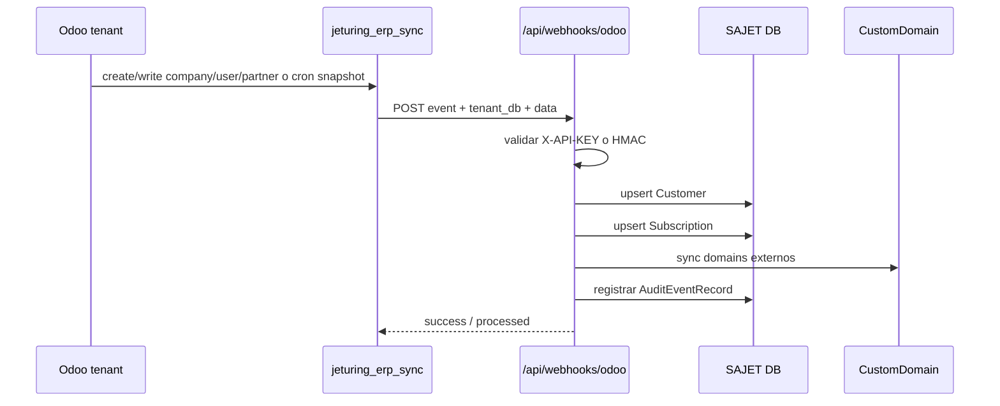

# Mapa del Ecosistema y Puntos de Quiebre

Estado: vigente  
Validado: 2026-03-27  
Fuente de verdad: inventario generado desde `Erp_core`, addons Odoo v17/v19 y contratos outbound detectados en código.

## Mapa global

```mermaid
flowchart LR
    Browser[Frontend SAJET / Browser] --> FastAPI[Erp_core FastAPI]
    AdminUI[Admin / Partner / Tenant Portals] --> FastAPI
    FastAPI --> PG[(PostgreSQL)]
    FastAPI --> Stripe[Stripe]
    FastAPI --> Mercury[Mercury]
    FastAPI --> Postal[Postal]
    FastAPI --> Cloudflare[Cloudflare]
    FastAPI --> Proxmox[Proxmox / PCT orchestration]
    FastAPI --> PCT105[Odoo PCT105 / Odoo 17]
    FastAPI --> PCTV19[Odoo v19 addons]

    Odoo17[Odoo 17 addons en /opt/odoo/Extra] --> Sync[jeturing_erp_sync]
    Sync -->|POST /api/webhooks/odoo| FastAPI
    Odoo17 --> Branding[jeturing_branding]
    Branding -->|GET /api/branding/tenant/{subdomain}| FastAPI
    Odoo17 --> KDS[jeturing_kds]
    KDS --> Uber[Uber Eats API]
    KDS --> DoorDash[DoorDash Drive API]
    Odoo17 --> ENFC[jeturing_e_nfc]
    ENFC --> FEL[FEL / DGII API]
    Odoo17 --> MetaHub[jeturing_meta_hub]
    MetaHub --> Meta[Meta Graph API]
    MetaHub --> AI[OpenAI / Anthropic / Gemini / GitHub / Local]

    Odoo19[Odoo 19 addons en /opt/odoo/custom_addons-v19] --> ClaudeApi[jeturing_claude_api]
    Odoo19 --> Sign[jeturing_sign]
    Odoo19 --> CEO[jeturing_ceo_dashboard]
    CEO --> Stripe
    Odoo19 --> Spiffy[spiffy_theme_backend]
    Spiffy --> FCM[Firebase Cloud Messaging]
```

## Secuencia crítica del sync Odoo -> SAJET



## Matriz de ruptura

| contrato | dependencia | síntoma de ruptura | dónde diagnosticar | impacto |
|---|---|---|---|---|
| `POST /api/webhooks/odoo` | API key/HMAC, red SAJET, payload Odoo | no se crean/actualizan `Customer`, `Subscription`, `CustomDomain` | Odoo logs + `/api/audit` + `odoo_webhooks.py` | alto |
| `GET /api/branding/tenant/{subdomain}` | SAJET branding, customer->partner mapping | Odoo cae a defaults Jeturing, se pierde white-label | logs `jeturing_branding`, `branding.py` | medio |
| `/api/provisioning/*` | X-API-KEY, Odoo local API, DB Odoo, Cloudflare, Proxmox | tenant no provisiona o queda a medias | `provisioning.py`, `/api/logs/*`, `/api/nodes/*` | alto |
| `/api/domains/*` | plan quota, DNS externo, Cloudflare, Nginx, tunnel | dominio no verifica o no enruta | `domains.py`, `domain_manager.py`, `/api/domains/{id}/*` | alto |
| `/webhook/stripe` | firma Stripe, metadata checkout, StripeEvent | pago llega pero no crea subscription/provisioning | `onboarding.py`, tabla `stripe_events` | alto |
| `/api/mercury/webhook` | firma Mercury, payment processor | deposito no reconcilia | `mercury_webhooks.py`, `PaymentProcessor` | alto |
| `/api/v1/webhooks/postal-delivery` | firma Postal, schema evento | se pierde medición de correo por tenant | `postal_webhooks.py`, `postal_service` | medio |
| `jeturing_universal_api` / `jeturing_claude_api` | API key, DB target, permisos de modelo | clientes externos no pueden leer/escribir en Odoo | controller universal, `claude.api.key` | alto |
| `jeturing_kds` webhooks | firmas/provider IDs | ordenes delivery no entran o no actualizan estado | controllers `uber_webhook.py`, `doordash_webhook.py` | alto |
| `jeturing_sign` rutas públicas | token documento, OTP, storage | firma o descarga pública falla | `jeturing_sign/controllers/main.py` | alto |
| `jeturing_meta_hub` | Meta Graph API / AI providers | mensajería social o IA deja de responder | `social_account.py`, `meta_ai_agent.py` | medio-alto |
| `spiffy_theme_backend` JSON routes | vendor theme JS / FCM creds | UX backend degradada, push falla | controllers/theme JS + `mail_channel.py` | medio |

## Lectura por área

- **Acceso y gobierno**: auth admin, JWT, roles, audit, settings, API keys.
- **Comercial y portales**: customers, partners, onboarding, branding, work orders, blueprints.
- **Infra tenant**: provisioning, tenants, nodes, tunnels, domains, tenant portal.
- **Billing y dinero**: Stripe, Mercury, Postal, invoices, seats, reconciliation, payouts, treasury.
- **Odoo v17/v19**: contratos HTTP propios, contratos salientes y dependencias vendor.

## Observabilidad transversal

- OpenAPI SAJET: `/openapi.json`, `/sajet-api-docs`, `/sajet-api-redoc`.
- Auditoría SAJET: `/api/audit`.
- Logs backend: `/api/logs/*` y logging del servicio FastAPI.
- Logs Odoo PCT: `/var/log/odoo/odoo.log`, `/var/log/odoo/stderr.log`.
- Pruebas confirmadas del sync: `tests/test_odoo_webhooks.py`, `tests/test_domains.py` con `7 passed` el `2026-03-27`.
